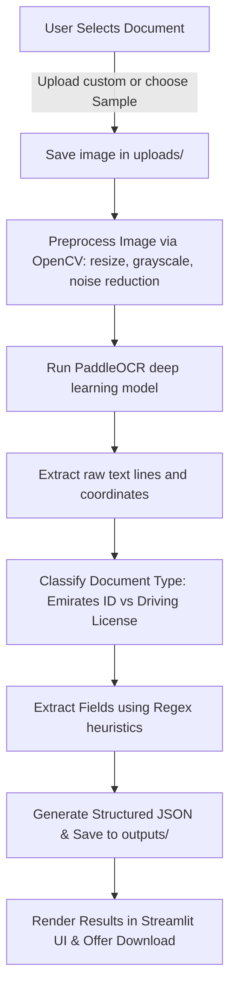

# UAE Document OCR Extraction System

An automated, clean, and beginner-friendly system to extract structured identification details from **UAE Emirates IDs** and **UAE Driving Licenses** using **PaddleOCR** and **Streamlit**.

The application utilizes OpenCV image preprocessing pipelines to optimize text extraction quality, classifies the document based on contextual keywords, applies targeted Python Regular Expressions (Regex) to extract structured fields, and returns the output in a structured JSON response format.

---

## 📁 Project Directory Structure

The project follows a clean, modular folder structure designed for scalability and maintainability:

```text
uae_ocr_project/
│
├── app.py                     # Streamlit frontend dashboard application
├── requirements.txt           # Required Python packages
├── README.md                  # Comprehensive guidelines and setup
│
├── uploads/                   # Temporary directory storing user-uploaded files
├── outputs/                   # Directory saving generated structured JSONs
│
├── utils/                     # Modular backend utilities package
│   ├── __init__.py            # Exposes core package interfaces
│   ├── ocr_engine.py          # PaddleOCR singleton initialization & text extractor
│   ├── parser.py              # Document type detection and regular expressions parser
│   ├── preprocessing.py      # OpenCV image enhancement pipeline (resize, grayscale, blur)
│   └── helpers.py             # File saving, JSON exports, and string sanitization
│
├── samples/                   # Preloaded high-quality sample mock documents
│   ├── emirates_id_sample.jpg
│   └── driving_license_sample.jpg
│
└── assets/                    # Static image assets for branding
    └── logo.png
```

---

## ⚡ Tech Stack Specs

- **Frontend Interface:** Streamlit (vibrant modern card layout with custom HSL styles)
- **OCR Engine:** PaddleOCR (English translation model)
- **Deep Learning Framework:** PaddlePaddle (CPU edition optimized)
- **Computer Vision:** OpenCV (v4 image preprocessing pipeline)
- **String Parsing:** Regular Expressions (Regex heuristics)
- **Core Platform:** Python 3.8+

---

## 🚀 Installation & Setup Guidelines

### 1. System Requirements & Prerequisites
Before installing, ensure that your system has **C++ Build Tools** installed, which is required by `layoutparser` and `paddleocr` components on Windows.
- For Windows: Install [Build Tools for Visual Studio](https://visualstudio.microsoft.com/visual-tools/) with the "Desktop development with C++" workload.

### 2. Set Up a Virtual Environment (Recommended)
Open your terminal/command prompt, navigate to the directory, and set up a virtual environment:

```bash
# Navigate to the project root
cd uae_ocr_project

# Create a virtual environment
python -m venv venv

# Activate virtual environment
# On Windows:
venv\Scripts\activate
# On macOS/Linux:
source venv/bin/activate
```

### 3. Install Dependencies
Install all required libraries using pip:

```bash
pip install -r requirements.txt
```

*Note: If you run into issues installing `paddlepaddle` or `paddleocr` on Windows, you can alternatively install them via standard pre-compiled wheel files or install CMake first using `pip install cmake`.*

---

## 🎮 Running the Application

To launch the Streamlit frontend dashboard locally:

```bash
streamlit run app.py
```

The application will start running on local port `8501`. A browser tab will automatically open at `http://localhost:8501`.

---

## 🔄 Application Flow Diagram



---

## 📦 Example JSON Responses

### 1. UAE Emirates ID Response Schema
When an Emirates ID is detected and parsed, the system responds with:

```json
{
    "success": true,
    "document_type": "Emirates ID",
    "data": {
        "document_type": "Emirates ID",
        "id_number": "784-1990-1234567-8",
        "name": "FAREED AL SHAMSI",
        "nationality": "United Arab Emirates",
        "gender": "Male",
        "date_of_birth": "15/05/1990",
        "expiry_date": "20/05/2030"
    },
    "raw_text": [
        "UNITED ARAB EMIRATES",
        "ID Number: 784-1990-1234567-8",
        "Name: FAREED AL SHAMSI",
        "Nationality: United Arab Emirates",
        "Sex: M",
        "Date of Birth: 15/05/1990",
        "Expiry Date: 20/05/2030"
    ]
}
```

### 2. UAE Driving License Response Schema
When a Driving License is detected and parsed:

```json
{
    "success": true,
    "document_type": "Driving License",
    "data": {
        "document_type": "Driving License",
        "license_number": "987654321",
        "name": "FAREED AL SHAMSI",
        "nationality": "United Arab Emirates",
        "date_of_birth": "15/05/1990",
        "issue_date": "10/10/2015",
        "expiry_date": "09/10/2030"
    },
    "raw_text": [
        "United Arab Emirates",
        "Driving License",
        "Lic No: 987654321",
        "Name: FAREED AL SHAMSI",
        "Nationality: United Arab Emirates",
        "Date of Birth: 15/05/1990",
        "Issue Date: 10/10/2015",
        "Expiry Date: 09/10/2030"
    ]
}
```

---

## 🛠️ Key Modules Explanation

1. **`preprocessing.py`:** Standardizes image width to 1000px, converts it to grayscale, and applies a Gaussian noise filter. Resizing ensures high-resolution card scans are scaled appropriately for standard PaddleOCR text-detector anchors, and noise reduction avoids OCR fragmentation in printed characters.
2. **`ocr_engine.py`:** Leverages a **Singleton design pattern** to initialize PaddleOCR once. This saves overhead since initializing the model weights takes several seconds.
3. **`parser.py`:** Uses advanced RegEx heuristics (combining proximity scans, letter casing, digit patterns, and chronological sorting) to correctly locate and bind dates, names, genders, and nationalities even if lines are slightly misaligned due to OCR scanning.
4. **`helpers.py`:** Secures uploads, assigns unique UUID tokens to files, sanitizes control inputs, and writes final outputs in compliant JSON structures.
